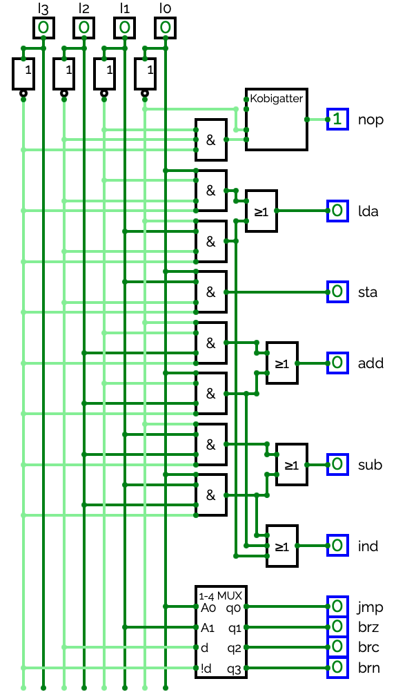

# Dokumentation Board 1

von: Luca Pinnekamp, Carolin Steger

## Aufbau

### CircutVerse
https://circuitverse.cs.hm.edu/users/234/projects/praktikum-4-b57bb048-e05d-476c-903f-f31e026de357 

https://circuitverse.cs.hm.edu/users/283/projects/praktikum-5-a3f33a6e-06d3-4b71-b812-1ffe298df51c 

Für das Instruktionsregister haben wir das SRG4 benutzt, so dass alle Werte parallel in den Instruktionsregister geladen werden können. Da das SRG4 keine negierten Ausgänge hat haben wir die nicht benötigten Kombigatter und ODER-Gatter zum negieren der Ausgänge benutzt. Die Ausgänge des Instruktionsregister sind direkt mit den Eingängen des Instruktionsdecoder verbunden. 

Bei dem Instruktionsdecoder haben wir die UND-Gatter A1 - A8 aus dem Schaltplan übernommen. Für die Befehle lda, add und sub gibt es zwei Adressierungsarten, um beide zu realisiren gibt es den zusätzlichen Ausgang ind, welcher 1 ist wenn der Befehl indirekt Adressiert wird. Für die Sprungbefehle haben wir zum decodieren einen Demultiplexer mit folgender belegung genommen.

| d   | !d  | A1  | A0  | jmp | brz | brc | brn |
| --- | --- | --- | --- | --- | --- | --- | --- |
| 1   | 0   | 0   | 0   | 1   | 0   | 0   | 0   |
| 1   | 0   | 0   | 1   | 0   | 1   | 0   | 0   |
| 1   | 0   | 1   | 0   | 0   | 0   | 1   | 0   |
| 1   | 0   | 1   | 1   | 0   | 0   | 0   | 1   |

## Test

Zum Testen haben wir einmal alle Befehle getestet, ob dort die richtigen Werte raus kommen. Dazu haben wir die Bitmuster manuell in das Instruktionsregister geladen. Die folgende Wahrheittabelle zeigt die Eingabewerte und die Ausgaben, die dabei entstehen sollen:

| d3  | d2  | d1  | d0  | nop | lda | sta | add | sub | jmp | brz | brc | brn | ind |
| --- | --- | --- | --- | --- | --- | --- | --- | --- | --- | --- | --- | --- | --- |
| 0   | 0   | 0   | 0   | 1   | 0   | 0   | 0   | 0   | 0   | 0   | 0   | 0   | 0   |
| 0   | 0   | 0   | 1   | 0   | 1   | 0   | 0   | 0   | 0   | 0   | 0   | 0   | 0   |
| 0   | 0   | 1   | 0   | 0   | 1   | 0   | 0   | 0   | 0   | 0   | 0   | 0   | 1   |
| 0   | 0   | 1   | 1   | 0   | 0   | 1   | 0   | 0   | 0   | 0   | 0   | 0   | 0   |
| 0   | 1   | 0   | 0   | 0   | 0   | 0   | 1   | 0   | 0   | 0   | 0   | 0   | 0   |
| 0   | 1   | 0   | 1   | 0   | 0   | 0   | 1   | 0   | 0   | 0   | 0   | 0   | 1   |
| 0   | 1   | 1   | 0   | 0   | 0   | 0   | 0   | 1   | 0   | 0   | 0   | 0   | 0   |
| 0   | 1   | 1   | 1   | 0   | 0   | 0   | 0   | 1   | 0   | 0   | 0   | 0   | 1   |
| 1   | 0   | 0   | 0   | 0   | 0   | 0   | 0   | 0   | 1   | 0   | 0   | 0   | 0   |
| 1   | 0   | 0   | 1   | 0   | 0   | 0   | 0   | 0   | 0   | 1   | 0   | 0   | 0   |
| 1   | 0   | 1   | 0   | 0   | 0   | 0   | 0   | 0   | 0   | 0   | 1   | 0   | 0   |
| 1   | 0   | 1   | 1   | 0   | 0   | 0   | 0   | 0   | 0   | 0   | 0   | 1   | 0   |