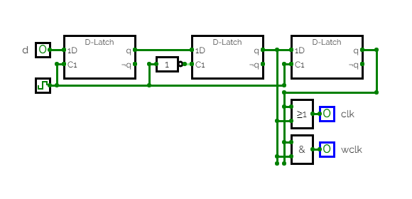
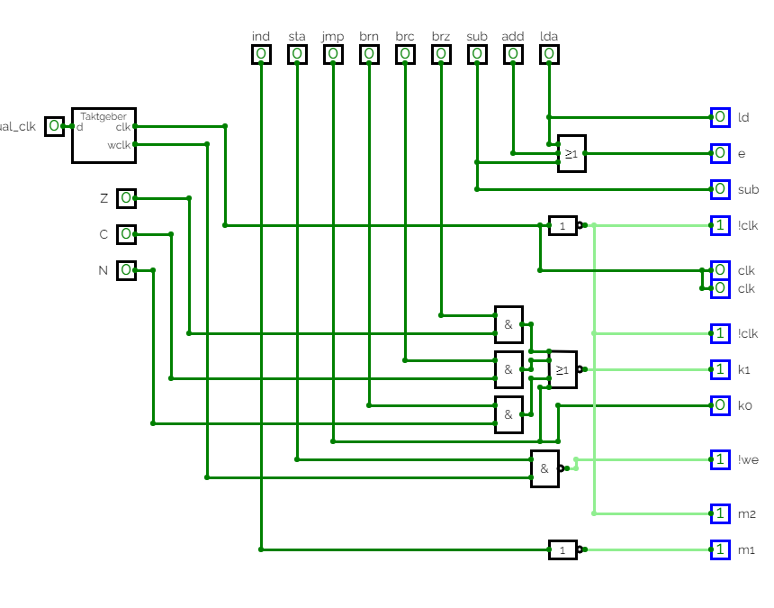
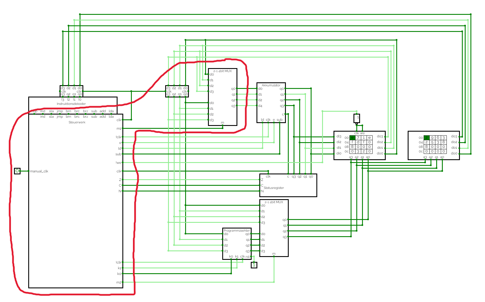

# Dokumentation Board 1

von: Luca Pinnekamp, Carolin Steger

## Aufbau

https://circuitverse.cs.hm.edu/users/234/projects/praktikum-4-b57bb048-e05d-476c-903f-f31e026de357 

https://circuitverse.cs.hm.edu/users/283/projects/praktikum-5-a3f33a6e-06d3-4b71-b812-1ffe298df51c 

### Taktgeber

Der Taktgeber ist mit dem Frequezgenerator und drei D-Latches umgesetzt. Um einen immer gleich bleibenden Abstand von einem halben Board Takt zu generieren wird der Ausgang des zweiten und dritten D-Latches verwendet. Diese Ausgänge werden einmal durch ein ODER für den clock und ein UND für den wclock zusammengeschlossen. Der zeitliche Ablauf des Taktgebers und die genertierten Signale können dem Pulsdiagramm entnommen werden. Für die Frequenz auf dem Board werden 10 Hz verwendet.

### Steuerwerk

Das Steuerwerk ist nach der Angabe aufgebaut. Zum invertieren werden des ind und clk Signals werden Gatter verwendet, welche anderweitig nicht benötigt werden.

### Datenregister

Für das Datenregister wird das SRG4 verwendet. Hier sind die vier vom Speicher kommenden Datenleitungen und das clk Signal angeschlossen. Die Ausgänge sind direkt mit dem Multiplexer verbunden.

### MUX

Der Multiplexer ist mit der ALU des Digiboards aufgebaut. Die zwei 4bit Eingänge sind mit den Datenleitungen vom Speicher und Datenregister belegt.  
Um die Verwendung als Multiplexer zu ermöglichen wurden die Eingänge S1 und S2 auf 0 gesetzt und M auf 1. Die Steuerung des Multiplexers erfolgt dann über die Eingänge S0 und S2.  
Sind diese Eingänge 0 wird der erste 4bit Eingang weitergeben, sind sie 1 wird der zweite 4bit Eingang weitergegeben. Da die Ausgeänge in der ALU negiert werden, werden auch hier anderweitig nicht benötigte Gatter verwendet, um die Ausgänge erneut zu negieren.

| S0  | S1  | Eingang 0 | Eingang 1 | Ausgang |
| --- | --- | ---       | ---       | ---     |
| 0   | 0   | 1111      | 0000      | 1111    |
| 1   | 1   | 1111      | 0000      | 0000    |

### Gesamt

Der rot makierte Bereich zeigt alle Komponenten, welche sich auf Board 2 befinden.

## Test