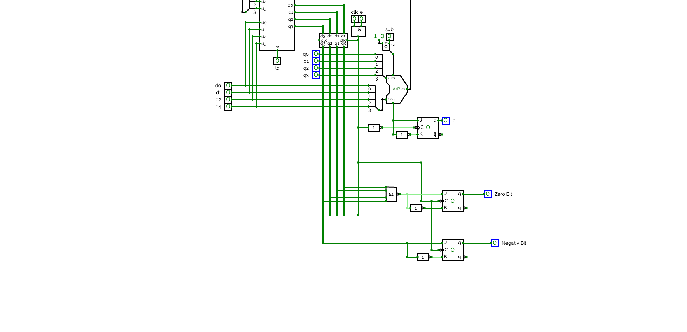
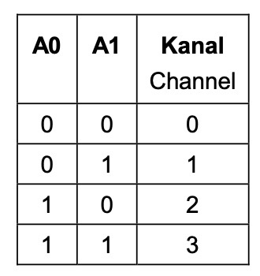

# Mikroprozessor Board 3 Akkumulator

von: **Julian Weichselbaumer und Lorenz Scheler**

## Akkumulator

Der Akkumulator besteht grundsätzlich aus unseren benötigten Steuerleitungen, 4 Datenleitungen aus dem Datenregister, einem 2-1 4 Bit Multiplexer, einem Schieberegister, einer ALU und einem Statusregister. Die Steuerleitungen vom Steuerwerk bestimmen, was der Akkumulator ausführt und wann er dies macht. Der 2-1 4 Bit Mulitplexer bestimmt über den Eingang des Akkumulators, hierbei werden entweder die 4 Datenleitungen des Datenregister gewählt oder das Ergebnis/Inhalt des Akkumulators selbst. Das Schieberegister ist unser Speicher des Akkumulators, hier werden bei einem Load Befehl die akutell anliegenden Daten hineingeladen und anschließend mit einem Datenbus weitergegeben. Unsere ALU ist mehr oder weniger der Hauptbestandteil unseres Boards, weil sie die Berechnungen ausführt die wir haben wollen. Sie addiert/subtrahiert den Wert unseres Speichers mit dem Wert, welcher momentan vom Datenregister kommt. Somit können wir Additionen/Subtraktionen mit dem Zweierkomplement realisieren. Damit wir uns noch einen besseren und ausführlicheren Überblick über diverse Zustände/Werte auf dem Board machen können, haben wir auch ein Statusregister implementiert. Dieses Statusregister beinhaltet ein Carry Bit, welches uns anzeigt ob es einen Übertrag gibt. Ein negativ Bit, welches uns sagt ob unser aktueller Wert negativ ist. Und ein Zero Bit, welches uns sagt ob der Inhalt unseres Speichers gerade leer ist oder nicht. Alle drei dieser Werte, werden zum Steuerwerk weiter gegeben.

### 2-1 4 Bit Multiplexer

Die Wahrheitstabelle ist die, welche für den Multiplexer der auf dem Board gegeben ist.
Hierbei gehen wir davon aus, dass A0 immer null ist. Somit ist nur A1 relevant und wir können uns aussuchen ob wir das Signal von Channel null oder eins nehmen. Ist die Steuerleitung also 1, werden die Daten vom Datenregister übernommen. Ist die Steuerleitung 0, dann wird die Ausgabe der ALU genutzt. 

Wir nutzen unseren gegebenen Multiplexer für den Eingang des 1. Outputs der ALU und von d0, danach bauen wir uns selbst 3 weitere Multiplexer. Eine Besonderheit bei dem gegebenen Multiplexer ist, dass wir nicht einfach a0 nicht berücksichtigen können, weil die Eingangsleitungen zum Steuern des Multiplexers vertauscht sind im Vergleich zur Dokumentation des Boards. Deshalb tauschen wir unsere Eingänge von a0 und a1. Somit ist a1 dann nicht belegt und a0 hat immer die Steuerleitung für die Multiplexer. Hier nimmt der erste selbst gebaute den zweiten Ausgang der ALU und d1. Der zweite selbstgebaute nimmt den dritten Output der ALU und d2. Der letzte selbstgebaute Multiplexer nimmt den vierten Output der ALU und d3. Um Übersicht zu bewahren nehmen wir gelbe Kabel für die Werte vom Datenregister und rote Kabel für die Outputs der ALU

### Schieberegister

Für den Eingang des Schieberegisters nehmen wir die jeweiligen Ausgänge der Multiplexer. Dafür benutzen wir die Eingänge 3,4D mit blauen Kabeln. Eingang 1,4D und 2,4D benötigen wir nicht, da wir vorerst nicht mit serieller Verschiebung arbeiten wollen. 

Die Ausgänge unseres Schieberegisters werden zu den Eingängen P0-P3 der ALU (schwarze Kabel) und sind gleichzeitig auch der Ausgang Richtung Datenbus(mit braunen Kabeln dargestellt).

## ALU 

Die ALU nutzt die Augänge des Schieberegisters (unseres Speichers) als P0-P3, weiterhin werden die Eingänge Q0-Q3 mit den Ausgängen des Datenregisters verbunden. Die ALU rechnet immer mit sofort anliegenden Werten und muss nicht mit einer Clock beschalten werden. 

### Carry Bit
Das Carry Bit der letzten Operation wird in einem JK FlipFlop gespeichert. Dafür muss der $\overline C \overline O$ der ALU in den Input K des JK Flipflops geleitet werden und die Negation von $\overline C \overline O$ in den J Input. Da diese Variante aber zeitlich versetzt wäre, müssen wir noch ein JK Flipflop zur Verzögerung zwischenschalten. Wir nehmen also den normalen und dem negierten Wert unseres ersten JK Flipflops und stecken sie in ein weiteres JK Flipflop. Da das Carry Bit ein enable Signal benötigt, nehmen wir unser Signal welches mit Clock und Carry verundet wurde und befördern es in beide JK Flipflops.

### Zero Bit
Alle Leitunge unseres Speichers q0-q3 werden durch ein NOR Gatter geleitet. In einem JK Flipflop werden diese zusammen mit der Clock zum Zero Bit. Der Sinn des Zero Bits ist es, zu signalisieren, wenn der Wert des Akkumulators 0 ist. Es ist also dementsprechend nur gesetzt wenn alle Leitungen des Speichers auch 0 sind.

### Negativ Bit

Das Negativ Bit ergibt sich aus q3. Dieses wird mit sich selbst, einer Negation von sich und der Clock in einem JK Flipflop zusammen geführt, welcher das Negativ Bit dann speichert. Das Negativ Bit und das Zero Bit sind positiv taktflankengesteuert.

## Testen

### Zero Bit Test
Das Zero Bit ist an, wenn alles null ist. Wenn man das Board anschaltet ist, müsste das Zero Bit also ein sein. Dies ist bei uns der Fall.
Weiterhin müsste es leuchten, wenn man eine Subtraktion oder Addition hat die 0 ergibt. z.B. 4-4 rechnet.

### Carry Bit Test 

Das Carry Bit ist gesetzt, wenn bei einer Rechnung der Zahlenkreis überschritten wird und man vom negativen in den positiven Bereich springt. Da die ALU aber z.B. bei 7-3 nicht 7-3 rechnet sondern -3+7, wird das Carry Bit in diesem Fall gesetzt.
Außerdem wird es auch gesetzt, wenn man bei einer Addition den 4 Bit Bereich der positiven Zahlen überschreitet z.B. 7 + 4 = 11

### Negativ Bit Test 
 Das Negativ Bit wird immer gesetzt wenn eine Zahl negativ ist, also mit einem minus in Verbindung steht.

### normale Addition 

Bei der normalen Addition, sollen zwei Werte addiert werden, ohne das ein Übertrag entsteht. Beispiel hierfür ist z.B. 1+1 oder 4+3.

Hierfür wird zuerst der erste Wert geladen. Im Anschluss wird ein neuer Wert geschaltet. Die Additon funktioniert dann automatisch ohne das Einschalten einer Clock, weil die ALU immer rechnet. Wenn man das Signal dann wieder lädt muss der Wert der zwei addierten Ziffern ausgegeben werden. 

Beim Beispiel von 4 + 3 kommt der Wert 7 --> funktioniert

### Addition mit Übertrag

Bei der Addition mit Übertrag entsteht ein Wert der zu groß für die Darstellung in 4 Bit ist, z.B: 7 + 3

Für den Test müsste also zuerst eine 7 in unseren Speicher geladen werden. Anschließend laden wir dann eine 3 hinein. Die ALU kommt nun auf ein Ergebnis von 10. Da die Darstellung im Zweierkomplement erfolgt kann er maximal eine positive 7 normal darstellen. 
Hier sollten dann das Carry Bit für den Übertrag und 1 normales Bit für den Wert 2 gesetzt werden, sodass man insgesamt eine 10 erhält.

### Subtraktion

Bei der Subtraktion gibt es wie bereits genannt die Besonderheit, dass die ALU nicht 7-3 sondern -3+7. Dabei wird dann ein Carry Bit erstellt. 

Um diese Subtraktion durchzuführen laden wir zunächst wieder eine 7 in unseren Speicher. Anschließend geben wir eine 3 ein, stellen SUB im Steuerwerk auf 1. Die ALU berechnet jetzt also den Wert von -3+7. Wir müssten nun das Negativ Bit und das Carry Bit anbekommen. Zusätzlich auch noch das dritte und vierte Bit des Schieberegisters