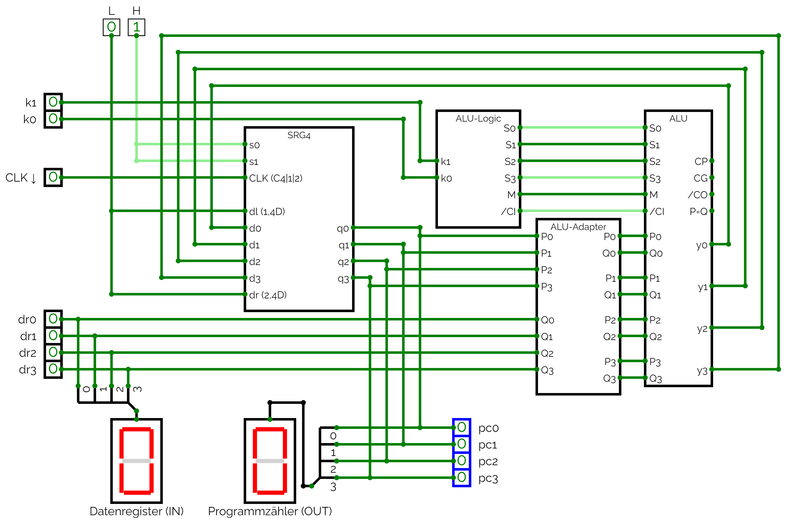
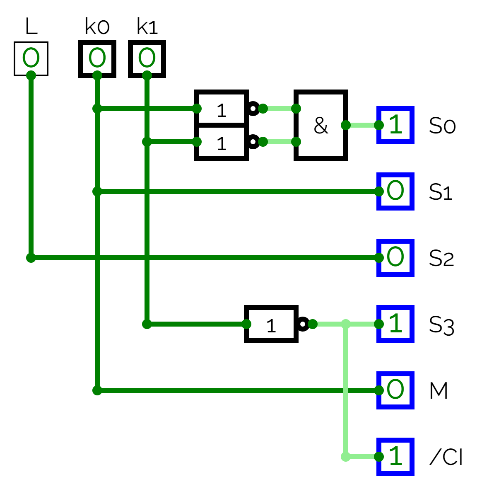
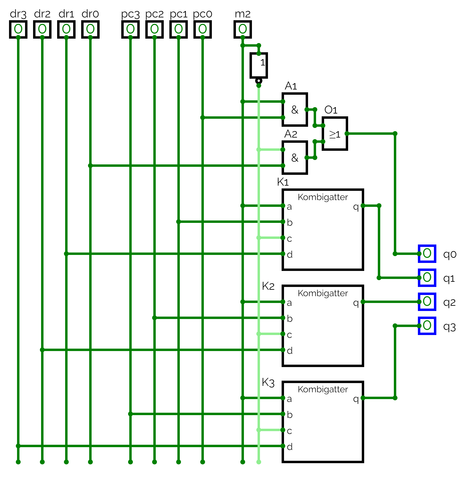

# Digiboard 4 (Programmzähler)
von: Tobias Malsam und Kornelia Wegele

## Wahrheitstabelle:

### k-Logik
| $k1$ | $k0$ | $`M`$ | $`S3`$ | $`S2`$ | $`S1`$ | $`S0`$ | $`Cl`$ | Befehle          |
| :--: | :--: | :---: | :----: | :----: | ------ | ------ | ------ | ---------------- |
|  0   |  1   |   1   |   1    |   0    | 1      | 0      | 1      | absoluter Sprung |
|  1   |  0   |   0   |   0    |   0    | 0      | 0      | 0      | nächster Befehl  |
|  0   |  0   |   0   |   1    |   0    | 0      | 1      | 1      | relativer Sprung |

Aus k1 und k0 ergibt sich folgende Logik (M-Cl) für die Ansteuerung der ALU.

$`M = {k0}`$

$`S3 = \overline{k1}`$

$`S2 = 0`$

$`S1 = {k0}`$

$`S0 = \overline{k1} \wedge \overline{k0}`$

$`Cl = S3`$

## Schaltungen in Circuitverse:

Link: https://circuitverse.cs.hm.edu/users/238/projects/mikroprozessor-board-4-e6449d43-2f47-415d-b0cc-30499003dcde

## Beschreibung:
Der von uns gebaute Programmzähler ist dafür da, die richtigen Befehle und Daten im Speicher anzusteuern. Dies kann auf 3 verschiedene Arten geschehen:
1. Nächste Adresse: Der Programmzähler wird jedes mal um 1 erhöht und geht somit sequenziell durch die Speicherzellen.
2. Relative Sprünge: Auf den aktuellen Wert im Programmzähler wird ein im Datenregister angelegter, neuer Wert addiert, somit springt der Programmzähler zu dieser neuen Adresse.
3. Absolute Sprünge: Der Programmzähler springt direkt zur anliegenden Zahl, da diese direkt als Adresse interpretiert wird. Hier muss also nichts addiert werden.

Zudem gibt es noch die Möglichkeit, entweder einen dieser Werte an den Daten- bzw. BefehlsRAM weiterzugeben, oder den Wert, der im Datenregister anliegt ohne Durchlaufen des Programmzählers direkt durchzugeben. Dies wird mithilfe eines Multiplexers realisiert, welcher abhängig von der anliegenden Steuerleitung (M2) entweder eines der vorher berechneten Ergebnisse (siehe Aufzählung) oder den anliegenden Wert aus dem Datenregister weitergibt.

Die Berechnungen selbst werden in den positiven Taktphasen durchgeführt und immer zu den negativen Taktflanken ins Register geschrieben, wodurch sichergestellt wird, dass das Ergebnis rechtzeitig zur positiven Taktflanke zur Verfügung steht. Der Programmzähler ist also negativ taktflankengesteuert.

Unser Programmzähler auf dem Digibaord ist mithilfe eines 4Bit Schieberegisters, und der ALU gebaut. Die ALU ersetzt hierbei die beiden Multiplexer und kombiniert diese mit dem Summierwerk. Hinter diesem Aufbau haben wir noch den Multiplexer geschaltet, welcher dann entweder den Ausgang des Programmzählers oder direkt den Ausgang des Datenregisters übernimmt und an den Speicher (Digiboard 5) weitergibt.

## Testdurchführung:
Hier gibt es 3 verschiedene Testfälle für den Programmzähler, welche wir durchführten:

1. Nächste Adresse:
Hierzu haben wir die Steuerleitungen k1 = 1 und k0 = 0 gesetzt und dann immer die Clock betätigt. Hierbei konnte beobachtet werden, dass der Wert im Programmzähler immer zur negativen Taktflanke um +1 erhöht am Schieberegister angelegen ist. Der Programmzähler hat also sequenziell hochgezählt, zwischen den Zahlen von 0 bis F (15).

2. Relativer Sprung: 
Hierzu haben wir k1 = 0 und k0 = 0 gesetzt und im Datenregister einen Wert angelegt. Rechtzeitig zur negativen Taktflanke lag dann im Schieberegister die Addition von dem aktuellen Wert des Programmzählers + dem Wert aus dem Datenregister an.

3. Absoluter Sprung:
Hierzu haben wir k1 = 0 und k0 = 1 gesetzt und im Datenregister einen Wert angelegt. Zur negativen Taktflanke (nach Betätigen der Clock) lag dann genau der Wert im Schieberegister an, welchen wir im Datenregister eingegeben haben.

Zudem haben wir unseren Multiplexer getestet, welcher mit Programmzähler und Datenregister verbunden ist: 
Wenn die Steuerleitung des Multiplexers M2 = 0 ist, dann wird direkt der Wert welcher im Datenregister anliegt durchgereicht.
Hingegen wenn diese Leitung M2=1 ist, wird der Wert des Programmzählers auf die Adressleitungen zum Daten-/InstruktionsRAM gelegt.

