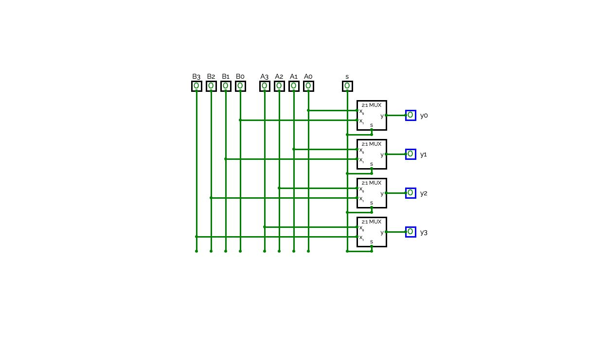
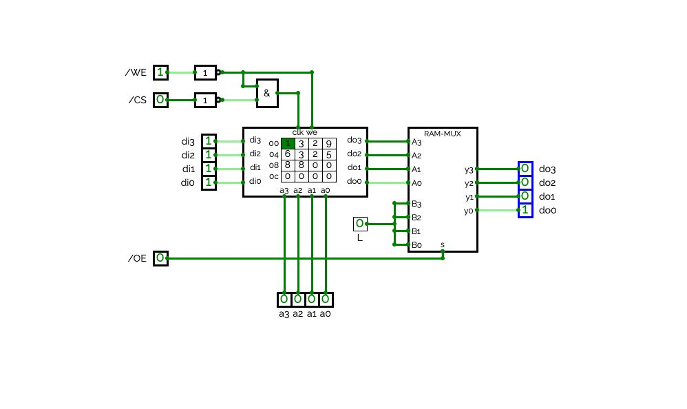
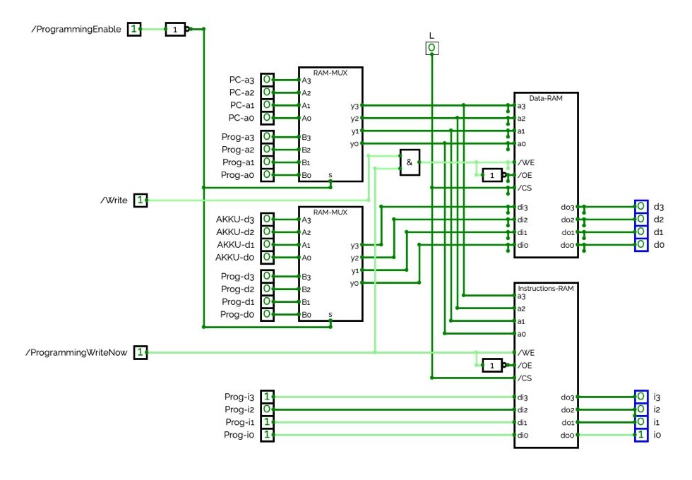

## Dokumentation des Digiboard 5 (Daten-RAM und Instruktionsspeicher):
von: Jan Skarbecki, Benedikt Geltinger

## Multiplexer für die zu schreibende Adresse:

Der erste Multiplexer (MUX3) entscheidet ob die zu schreibende Adresse vom Adressbus kommt oder ob sie manuell codiert wurde.
Auf unserem Digiboard ist der oberste Eingang (/ProgrammingEnabled) das Steuersignal für den Multiplexer. 
Das manuelle Codieren erfolgt über die unteren vier Eingänge. Dabei ist der unterte Eingang das 1. Bit.
Der Multiplexer wurde mithilfe von Kommbigattern aufgebaut.
Der Output, der die zu schreibende Adresse aus dem Multiplexer enthält, geht sowohl an den Daten-RAM als auch an den Instruktions-RAM.

## Multiplexer für die zu schreibenden Daten:

Der zweite Multiplexer (MUX4) entscheidet ob die zu schreibenden Daten aus dem Akkumulator oder aus dem linken Hexadezimal-Codierschalter kommen.
Für den zweiten Multiplexer dient ebenfalls der oberste Eingang (/ProgrammingEnabled) als das Steuersignal.

Der Output aus dem Multiplexer (MUX4) geht in den ersten 3-State-Bus Driver. 

## Schreiben in den Datenspeicher und den Instruktionsspeicher
Um in die beiden Speicherelemente speichern zu können kommt zum einen aus dem Steuerwerk ein Write-Signal sowie ein manuelles Programming-Write-Signal aus dem zweiten Eingang des Digiboards 5.
Diese beiden Signale kommen auf unserem Digiboard in ein "UND"-Gatter.
Der Output des "UND"-Gatters A01 fließt zum einen negiert in die beiden 3-State-Driver, außerdem fließt das nicht-negierte Signal in den WE-EIngang der beiden RAM-Bausteine.
## Zwei 3-State-Bus Driver 

Der Eingang für den ersten 3-State-Bus Driver stammt aus dem Mutliplexer (MUX4).

Der Eingang für den zweiten 3-State-Bus Driver stammt aus dem rechten Hexadezimal-Codierschalter.
Über den rechten Hexadezimal-Codierschalter können die Befehle für das Instruktionsregister programmiert werden.

Außerdem fließen in die beiden 3-State-Driver das negierte Signal aus dem Logikgatter A01.

## Daten-RAM
Die Speicheradresse wird über die Eingänge A0 bis A3 in den Datenspeicher geladen. In den negierten WE-Eingang fließt das Signal aus dem Logikbaustein A01. 
Das negierte A0 Signal fließt in den negierten OE-Eingang. In den negierten CS-Eingang fließt ein konstantes Low-Signal.
In den Datenspeicher fließen über die D3 bis D0 die tatsächlichen Daten aus dem ersten 3-State-Driver.
Außerdem können über die die Ausgänge D1 bis D3 die Daten die in den jeweiligen Adressen gespeichert sind, ausgelesen werden.

## Instruktions-RAM
Der Instruktor-RAM besitzt ebenfalls die Eingänge A0 bis A3 über die, die Speicheradresse in den Instruktsionsspeicher laden. Außerdem fließt in den negierten WE Eingang das
Signal des Eingangs /ProgrammingWriteNow. In den negierten OE Eingang fließt das negierte Eingangssignal /ProgrammingWriteNow.
In den negierten CS Ausgang fließt ein konstantes Low-Signal.
In den Instruktionsspeicher fließen über die D3 bis D0 Eingänge ebenfalls die Ausgänge aus dem zweiten 3-State-Driver.
Wie bei dem Daten-RAM können über die Ausgänge D1 bis D3 die Instruktionen in den jeweiligen Adressen gespeichert sind, abgelesen werden.

## Übersicht des 3-State-Driver mit dem RAM-Baustein 

## Gesamtaufbau des Digibord 5:

## Testen der Funktionalität
Um die Funktionalität des Boards zu testen, sind wir immer Schritt für Schritt vorgegangen. Zunächst bauten wir den Multiplexer auf und testeten diesen, um spätere Fehler zu minimieren. Hier ist uns sofort ein Fehler untergekommen, da der Hex-Zähler unten links auf dem Board bei mehr als zwei eingesteckten Kabel auf unserem Board falsche Werte ausgegeben hat. Nachdem wir diesen Bug gefixt haben, konnten wir mit der implementierung fortfahren und haben somit schwerwiegende Folgefehler ausgeschlossen. Anschließend haben wir das gesamte Board zusammengesteckt und es sind keine weiteren Fehler aufgetreten. Als das Board fertig gesteckt war, haben wir es wie folgt getestet: Wir haben jede Speicherstelle seperat beschrieben und das durchschalten der Steuersignale sowie Programmiersignale getestet und dessen Funktionalität bestätigt. Als wir jede Speicherstelle beschrieben haben, haben wir die Daten gelesen auf jeder Speicherstelle und notiert, ob die korrekten Werte ausgegeben werden. Als das einwandfrei funktioniert hat, schalteten wir Board 4 dazu, um die Speicherstellen effektiver anzusprechen.
