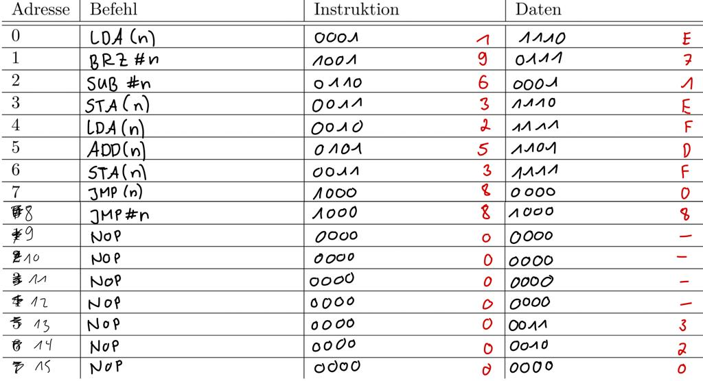
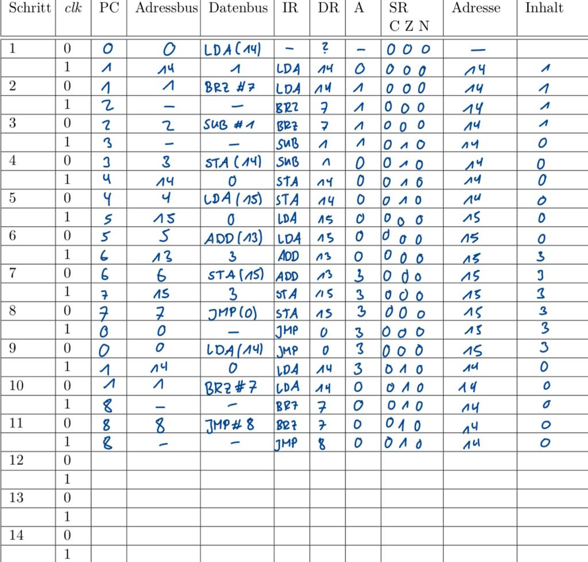

## Testprogramm 1

In diesem Testporgramm haben wir alle Funktionen der Multiplikation getestet.
Dabei stand vor allem die Funktionaliät der BRZ und JMP Befehle im Fokus.
Im Anschluss ist einmal die Speicherbelegung zu finden, sowie der Programmablaufplan einer 3x1 Multiplikation.

 
